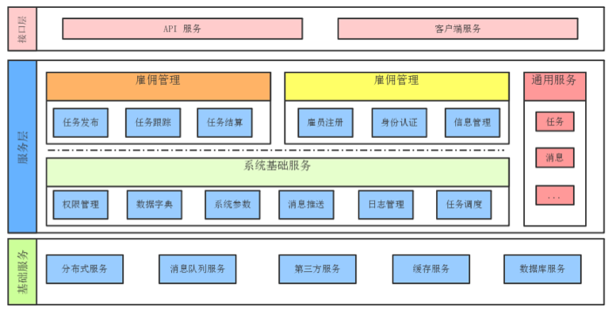

> 面向在校大学生的分布式短期雇佣任务管理系统，本科毕业设计，基于Nutzwk。

# 使用说明

## 环境依赖

- redis
- zookeeper
- RabbitMq
- Java1.8

## 系统设计

模块说明：

1. gyb-nb-dubbo-sys:  	    其他服务基础，提供用户权限管理基础服务。
2. gyb-nb-dubbo-msg:  	    提供邮件传输等消息消费服务，需要进行邮箱配置。
3. gyb-nb-dubbo-library:	提供任务，技能信息管理微服务。
4. gyb-nb-dubbo-gy:         提供雇员认证，雇员基础数据管理等微服务。
5. gyb-nb-dubbo-xm:   	    提供雇佣交易服务，维护阶段性任务流程。
6. gyb-nb-dubbo-web:  	    依赖其他微服务，实现Web界面服务。
7. gyb-nb-task:       	    基于quartz提供自定任务调度等服务。
8. gyb-nb-cms:       	    内容管理服务。
9. gyb-nb-web-api:          API支持。

## 项目构建

`bin`目录下包括基于maven构建和apidoc插件的相关脚本，主要内容如下:

- 构建：`sh ./bin/build.sh`
- 启动：`sh ./bin/gyb.sh start`
- 停止：`sh ./bin/gyb.sh stop`
- 单个服务启停：`sh ./bin/jar.sh 1`,1对应gyb-nb-service-sys,具体配置看sh.
- api生成：`sh ./bin/apidoc.sh`,主要生成gyb-nb-web-api的文档，相关配置设置见`apidoc.json`
- api文档ftp上传：`sh ./bin/apisync.sh`,脚本中可以自行设置服务器相关信息

在测试启用过程之中，建议按照需要进行启动，8,9模块仅为测试，并未参与项目构建之中。

系统架构图如下:




*注意*

1. 出现`java.lang.SecurityException: JCE cannot authenticate the provider BC`

    1. 编辑文件 ${JAVA_HOME}/jre/lib/security/java.security,在9下面添加 security.provider.10=org.bouncycastle.jce.provider.BouncyCastleProvider
    2. 拷贝 bin/bcprov-jdk16-140.jar 到 ${JAVA_HOME}/jre/lib/ext 目录下


# 缺陷管理

针对协作开发者而言，TAPD和Github通过webhooks进行绑定。
通过commit message传递消息,模板如下（100018为bug编号，Marveliu为TAPD昵称）:

```
--bug=1000018 --user=Marveliu
add:*
update:*
fix:*
upgrade:*
```


