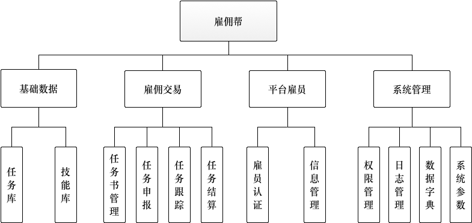

系统设计
-----------

系统的主要设计模块如下：

1. 基础数据：平台基础数据集组织与维护。
2. 雇佣交易：维护平台整个的雇员交易流程。
3. 平台雇员：负责平台雇员信息的审核，认证以及维护。
4. 系统管理：与系统相关的操作功能。

-----

1. 基础数据

   基础数据主要包括：任务和技能类型。且都是为树状的组织类型，任务和技能之间是多对多的关系。通过对任务绑定技能，可以实现对任务类别要求的设定。同时，雇员通过技能库可以实现对自身技能评级，从而作为雇员能否申请任务的依据。

2. 雇佣交易

   1. 任务书管理：产品经理填写并确定发布任务书，雇员可以在相关的界面浏览任务书的内容，并根据自身技能等级选择申报合适的任务书。
   2. 任务申报：产品经理对同一时刻申报任务书的雇员进行身份的审核，选择**唯一**雇员进行立项。
   3. 任务跟踪：产品经理和雇员之间相互反馈，由雇员填写规定时间段的现有成果，产品经理进行审核和反馈，过程反复直到产品经理验收最终成果。
   4. 任务结算：产品经理对于完成的任务进行评价以及账单填写，雇员确认收款方式并核对账单，之后，转入财务系统进行汇款。

3. 平台雇员

   1. 雇员认证：包括身份认证，以及技能认证。
      1. 身份认证：雇员注册时，上传自身的身份证，学生证等信息，后台进行审核和确认。
      2. 联系方式认证：对邮箱，电话号码进行验证。
      3. 技能认证：**待定**。
   2. 信息管理：
      1. 基础信息管理：对雇员基本信息进行修改，包括联系方式，密码等。
      2. 支付信息管理：对雇员的收款信息进行管理，支持设置默认的收款方式。

4. 系统管理

   1. 权限管理：方法级别的权限管理体系。用户-角色-菜单（权限代码）对用户的权限进行设置。
   2. 日志管理：记录系统的运行日志。
   3. 数据字典：平台系统相关的数据映射内容。
   4. 系统参数：系统全局参数设置。

