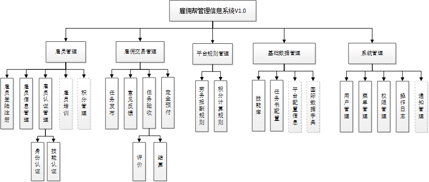
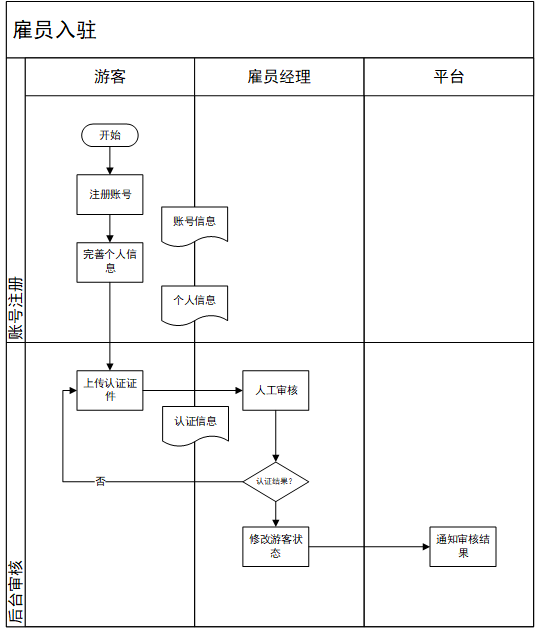
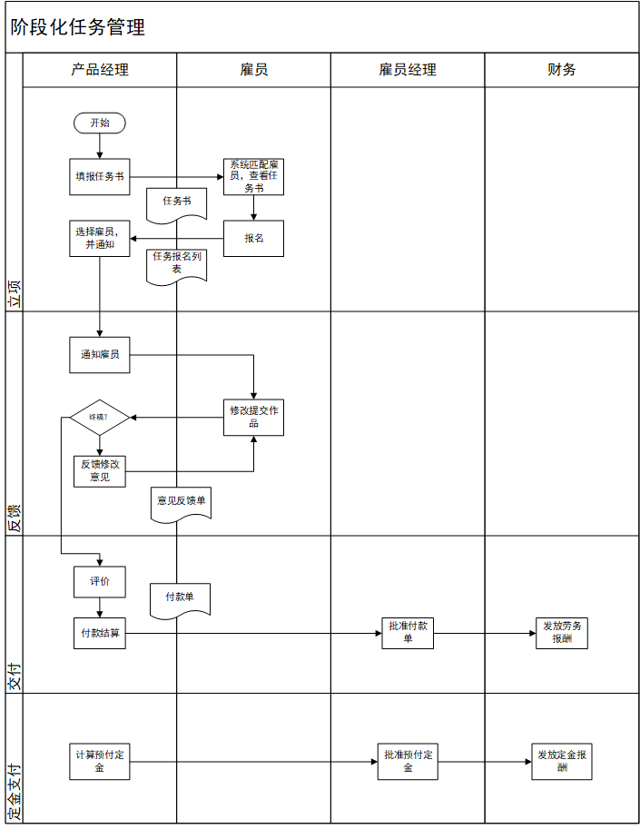
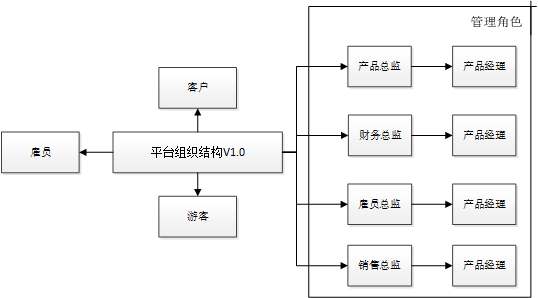

雇员管理系统
===

> 本系统旨在，对雇佣帮体系结构下的雇员进行管理维护，以及平台任务交易流程管理。

# 1.基本模块

任务书基础结构+任务书的需求配置

立项：

报名：大家报名之后按照先后人工筛选，任务书下达的产品经理。

抢单：

项目开始：

初稿：第一次提交的作品

修改反馈的过程：

反馈单：产品经理和客户沟通，由反馈经理进行填写。

项目结束

产品经理结束反馈，认定最后版本。

评价：目前综合打分，以后则是以不同的维度进行区分，并进行总结留言。

付款结算：根据公式进行生成，但是要提供相关的数据，如雇员等级，之前的报酬，最后金额由人工进行填制。出付款确认单，并提醒雇员经理进行审批。

定金：一旦和雇员签订之后，产品经理可以申请预付定金，雇佣经理审批通过之后，财务进行放款。

财务经理：只是需要确认是否发放。

##  1.1 雇员管理

在本模块中，诸如雇员登陆注册，基础信息修改等模块，需求较为大众，多为对数据的增删改查。与平台业务关联紧密的主要是，雇员认证模块，以及需要做好扩展的雇员培训，积分管理等模块。

### 1.1.1 雇员身份认证

游客提交身份认证的时候，需要提交自身的身份证，学生证等证件，交由雇员进行进行审核，审核通过之后，成为正式的雇员。

### 1.1.2 雇员技能认证

>雇员技能认证反映了平台的认证体系，认证体系在平台体系模块中进行管理，对于不同技能类型可以进行不同的认证，同时对于雇员有一个总认证。
>
>特定的技能评级是为了选拔技能突出的雇员。
>总评级是为了反映雇员在平台的整个状态。
>积分是反映了雇员在平台上面的活跃程度。

目前暂定的评价体系有五级,评价体系有以下作用：

1. 用于匹配任务书等级，
2. 用于雇佣劳务的报酬进行计算。

## 1.2 雇佣交易管理

该交易模块以阶段化任务管理为基础，对其中的三个主要流程：任务发布，意见反馈，任务验收进行管理。

### 1.2.1 任务发布管理

1. 产品经理根据客户的需求，在系统上发布任务书。
2. 平台自动匹配满足任务书等级要求的雇员列表。
3. 通知雇员查看信息并进行报名。
4. 产品经理根据报名雇员列表进行筛选并立项。

### 1.2.2 意见反馈管理

>此过程是一个循环的过程

终止条件：产品经理确定最近一次提交的作品为终稿。
循环过程：
1. 雇员提交作品。
2. 产品经理提交意见反馈单。

### 1.2.3 任务验收管理

1. 评价：目前评价体系是以总分+留言形式，考虑到方便之后的数据分析，需要完成多维度评分的扩展。
2. 结算：结合任务书等级，预付定金情况对项目最后的付款进行进行结算（暂定为手工，但是计算总的相关参数系统上面进行显示），生成付款单，交由雇员经理进行审批。

### 1.2.4 定金预付

> 在交易的过程之中，可能会预付部分定金作为对雇员的激励，此过程发生在立项之后任何 环节，但是此项功能暂定为平台隐藏功能。

1. 产品经理填写定金预付单。
2. 雇员经理审批。
3. 财务进行发放。

## 1.3 平台规则管理 

### 1.3.1 劳务报酬规则

> 目前手工，但是希望之后由系统进行动态的计算。

雇员实际所得:任务书约定报酬*评级+额外奖励(不超过30%)-违规扣除（暂定）。

### 1.3.2 积分计算规则

> 个人积分将来可能涉及积分商场等业务，需要支持良好的扩展能力。

涉及积分主要的事务包括：

1. 个人信息完善。
2. 完成平台的雇佣劳务。
3. 产品经理给予用户评价。

## 1.4 基础数据管理

### 1.4.1 技能库

对于平台的技能类型进行管理，与数据词典类似，采取层次化的树状结，包括：父类技能，子类技能。
依据技能的类型，可以设置相关的业务，并且雇佣可以对该技能进行能力认定，

### 1.4.2 任务书配置

> 针对不同的技能有着不同的任务书。

任务书 = 任务书基本信息+任务书配置信息。

1. 任务书基本信息包括雇员编号，任务名称，任务编号，交易金额，交易时间等相关信息。
2. 任务书配置信息主要是对任务需求的描述。

### 1.4.3 平台配置信息

> 平台本身有很多的配置信息，如名称，数据库连接，平台相关协议，客服电话等等。

此模块应用在系统的各个方面，是优先度较高的扩展模块，前期开发的时候应该做好扩展的准备。

## 1.5 后期扩展模块

后期扩展的模块，希望支持以插件的形式进行扩展。

### 雇员培训

> 该模块非必需模块，开发计划相应的推迟。
> 给雇员定期的培训,报名签到

### 积分系统

成交订单,积分商城,后序操作,历史积分和可用积分
参与培训,成交单子
雇员推荐计划
雇员分成计划,拉过私活给平台,平台给分成

# 2.基本流程

## 2.1 **雇员**入驻

## 2.2 阶段化任务管理

# 3.平台组织结构

## 平台角色

1. 客户:发布销售单。

2. 雇员:了解沟通。

3. 管理角色：总监与经理。

    > 总监管理经理，可以查看该业务模块下所有经理的工作内容，经理只能看自己负责下的工作内容。

    1. 产品：发布任务书,公司内部人员。
    2. 财务：负责打款。
    3. 雇员：负责对雇员的角色进行审核。
    4. 销售：和系统关联度不大。

